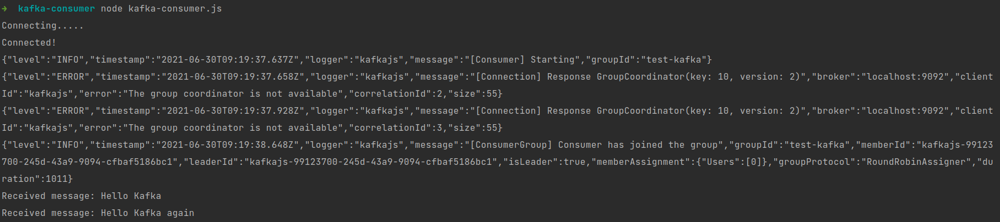

## Demo Kafka with Spring Boot (Producer) and NodeJS (Consumer)

### Introduction

- In this demo, I will use Spring Boot with spring-kafka dependency for Producer.
- For Consumer, I will use NodeJS with kafkajs library.
- Diagram for this demo <br/>
  

### Configuring Topic "Users"

- First, we need to install Kafka in here: https://kafka.apache.org/downloads

#### <b><i>Start Zookeeper</i></b>

- Zookeeper is basically to manage the Kafka cluster. It comes bundled with the downloaded Kafka directory. So, we need
  not download it separately.
- To start the zookeeper, go to the bin directory where we installed kafka and enter the below command.

```shell
./zookeeper-server-start.sh ../config/zookeeper.properties
```

#### <b><i>Start Kafka Broker</i></b>

- Next, To start the Kafka broker, run the below command in the same directory

```shell
./kafka-server-start.sh ../config/server.properties
```

- Make sure the zookeeper is running before starting Kafka because Kafka receives information such as Offset information
  kept in the partitions from Zookeeper.

#### <b><i>Create a Kafka Topic.</i></b>

- After running Zookeeper and Apache Kafka respectively, We can create a Topic and send and receive data as Producer and
  Consumer. In this case I will create the "Users" topic

```shell
./kafka-topics.sh --create --bootstrap-server localhost:9092 --topic Users
```

- Here we are creating a topic Users to handle messages. We would be using this topic later in the demo application.

- Now, Let's write some code.

### Installation and Setup for Spring Boot Producer

- Create Spring Boot project in https://start.spring.io
- We will use dependencies for this project:

```xml
<dependencies>
    <dependency>
        <groupId>org.springframework.boot</groupId>
        <artifactId>spring-boot-starter</artifactId>
    </dependency>

    <dependency>
        <groupId>org.springframework.boot</groupId>
        <artifactId>spring-boot-starter-web</artifactId>
    </dependency>

    <dependency>
        <groupId>org.springframework.kafka</groupId>
        <artifactId>spring-kafka</artifactId>
    </dependency>

    <dependency>
        <groupId>org.springframework.boot</groupId>
        <artifactId>spring-boot-starter-test</artifactId>
        <scope>test</scope>
    </dependency>
    <dependency>
        <groupId>org.springframework.kafka</groupId>
        <artifactId>spring-kafka-test</artifactId>
        <scope>test</scope>
    </dependency>
</dependencies>
```

### Producing Messages

- To create messages, we first need to configure a ProducerFactory. This sets the strategy for creating Kafka Producer instances.

- Then we need a KafkaTemplate, which wraps a Producer instance and provides convenience methods for sending messages to Kafka topics.

- Producer instances are thread safe. So, using a single instance throughout an application context will give higher performance. Consequently, KakfaTemplate instances are also thread safe, and use of one instance is recommended.

```java
@EnableKafka
@Configuration
public class KafkaProducerConfig {
    @Bean
    public KafkaTemplate<String, String> kafkaTemplate() {
        return new KafkaTemplate<>(producerFactory());
    }

    @Bean
    public ProducerFactory<String, String> producerFactory() {
        return new DefaultKafkaProducerFactory<>(producerConfigurations());
    }

    @Bean
    public Map<String, Object> producerConfigurations() {
        Map<String, Object> configurations = new HashMap<>();
        configurations.put(ProducerConfig.BOOTSTRAP_SERVERS_CONFIG, "localhost:9092");
        configurations.put(ProducerConfig.KEY_SERIALIZER_CLASS_CONFIG, StringSerializer.class);
        configurations.put(ProducerConfig.VALUE_SERIALIZER_CLASS_CONFIG, StringSerializer.class);
        return configurations;
    }
}
```

- Now, We can create a controller to receive message request from client and then publish this message using KafkaTemplate

```java
@RestController
@RequestMapping("/api/send")
public class KafkaProducerController {
    private final KafkaTemplate<String, String> kafkaTemplate;

    @Autowired
    public KafkaProducerController(KafkaTemplate<String, String> kafkaTemplate) {
        this.kafkaTemplate = kafkaTemplate;
    }

    @PostMapping
    public void sendMessage(@RequestBody Map<String, String> message) {
        //Sending the message to kafka topic queue
        kafkaTemplate.send("Users", message.get("message"))
                .addCallback(new ListenableFutureCallback<SendResult<String, String>>() {
                    @Override
                    public void onSuccess(SendResult<String, String> result) {
                        System.out.println("Sent message=[" + message +
                                "] with offset=[" + result.getRecordMetadata().offset() + "]");
                    }

                    @Override
                    public void onFailure(Throwable throwable) {
                        System.out.println("Unable to send message=["
                                + message + "] due to : " + throwable.getMessage());
                    }
                });
    }
}
```

### Consuming Messages

- For consuming messages, I will use NodeJS to subscribe topic "Users".
- Alternatively, We can use any programming language for this implementation, I want to use NodeJS for demonstration purpose

### Installation and Setup for NodeJS Consumer

- In this demo, I will use nodejs and kafkajs
- First, we will initialize nodejs project

```shell
npm init -y
```

- Install kafkajs

```shell
npm install kafkajs
```

- Now, We create kafka-consumer.js file to implement consuming message from producer.

```javascript
const { Kafka } = require("kafkajs");

const run = async () => {
  try {
    const kafka = new Kafka({
      brokers: ["localhost:9092"],
    });

    const consumer = kafka.consumer({ groupId: "test-kafka" });
    console.log("Connecting.....");
    await consumer.connect();
    console.log("Connected!");

    await consumer.subscribe({
      topic: "Users",
      fromBeginning: true,
    });

    await consumer.run({
      eachMessage: async (result) => {
        console.log(`Received message: ${result.message.value} `);
      },
    });
  } catch (err) {
    console.log(`Something bad happened ${err}`);
  }
};

run();
```

### Test Application

- Let's test everything we build until now.
- Your server should be running on port 8080 and you can make API requests against it!
- Now run NodeJS application with `node kafka-consumer.js`
- You can use Postman to do a POST request. In this demo, I will use Insomnia as shown below.<br/>
  <br/>
  <br/>
- After click Send button, in terminal console of NodeJS application will show message.<br/>
  
